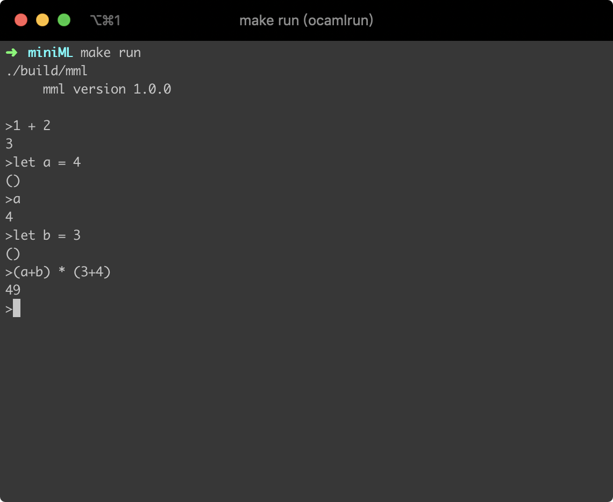
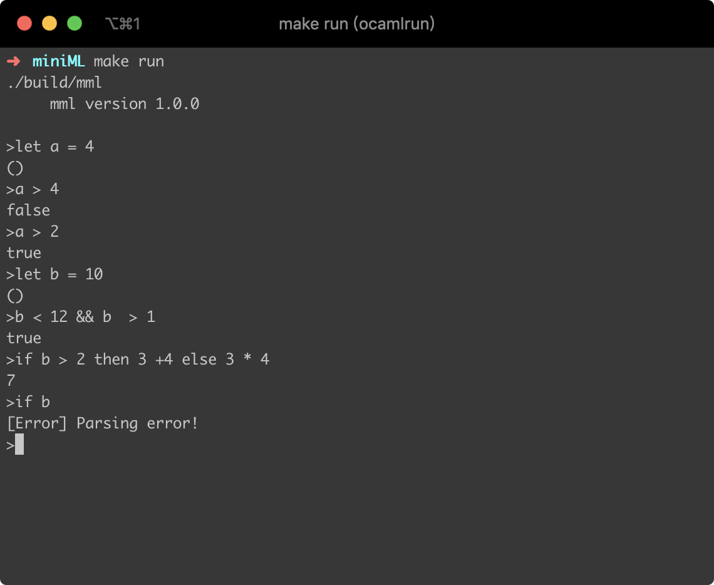

miniML
------------
mml语言解释器

#### 项目介绍
mml语言（miniML语言的简称）是Ocaml语言的一个的子集，仅仅包含了Ocaml中的一部分基本功能。本项目可以在命令行直接运行，类似于脚本语言的解释器。

##### 背景
本学期修了《编译原理》这门课，而这门课的课程设计要求实现C-Minus语言的编译器，于是我灵光一现——使用Ocaml来实现一个Ocaml的子集。正好Ocaml提供`ocamllex`、`ocamlyacc`等工具，我们可以非常方便地构造词法分析器和语法分析器。

##### mml语言
1. 词法
- 关键字：`if`、`then`、`else`、`let`、`true`、`false`、`not`
- 专用符号：`+`、`-`、`*`、`/`、`(`、`)`、`>`、`<`、`>=`、`<=`、`=`、`<>`、`||`、`&&`
- 整数
- 标识符
2. 语法和语义
具有基本的变量赋值、算数运算等功能。具体文法采用BNF范式书写，具体如下：
```
main ->   ε EOL
        | expr EOL 
        | LET ID EQUAL expr EOL
expr ->   INT
	| TRUE
	| FALSE
	| expr EQUAL expr
	| expr NEQ expr
	| expr LT expr
	| expr GT expr
	| expr LE expr
	| expr GE expr
	| expr PLUS expr
	| expr MINUS expr
	| expr MUL expr
	| expr DIV expr
	| LPAREN expr RPAREN
	| ID
	| IF expr THEN expr ELSE expr
	| NOT expr
	| expr OR expr
	| expr AND expr 
```

#### 项目架构
```
|-- miniML 项目根目录 
	|-- miniML 源代码目录
		|-- lex.mml 词法分析器
		|-- parser.mly 语法分析器
		|-- syntax.ml 语法树生成器
		|-- type.ml 类型检查器
		|-- main.ml 程序入口文件兼语义分析器
		|-- Makefile 工程脚本文件
	|-- build 目标文件目录
		|-- mml 目标文件
	|-- Makefile 工程脚本文件
	|-- README.md 说明文档
```

#### 实现功能
- [x] 变量声明与赋值
- [x] 四则运算计算结果
- [x] 关系运算输出`true`或`false`
- [x] `if else`条件语句判断
- [x] 代码出错提示

#### 代码说明

##### lex.mll 词法分析器模块 
使用方法与`flex`类似，直接在文件中定义各种token的正则表达式即可。
```Ocaml
(* 数字 *)
let NUM = ['-']?(['1'-'9']['0'-'9']*|"0")

rule token = parse

(* 识别保留字 *)
| "if"          {IF}
| "then"        {THEN}
| "else"        {ELSE}
| "let"         {LET}

(* 识别数字和标识符 *)
| NUM           {INT(int_of_string(Lexing.lexeme lexbuf))}
| ['A'-'Z' 'a'-'z' '_']['A'-'Z' 'a'-'z' '_' '0'-'9']* {ID(Lexing.lexeme lexbuf)}

(* 识别空格与换行符 *)
| [' ' '\t']    {token lexbuf}
| ['\n']        {EOL}

(* 识别算数运算符 *)
| '+'           {PLUS}
| '*'           {MUL}
| '/'           {DIV}
| '-'           {MINUS}

(* 识别括号 *)
| '('           {LPAREN}
| ')'           {RPAREN}

(* 识别Ture和False*)
| "true"        {TRUE}
| "false"       {FALSE}

(* 识别关系运算符 *)
| "<="          {LE}
| ">="          {GE}
| ">"           {GT}
| "<"           {LT}
| "<>"          {NEQ}
| "="           {EQUAL}

(* 布尔运算符*)
| "not"         {NOT}
| "||"          {OR}
| "&&"          {AND}

(* 识别输入末尾 *)
| eof         {raise Eof}
```

##### parser.mly 语法分析器模块
使用方法与`bison`类似，需要使用规定的格式书写文法。在文法中嵌入语义动作生成语法分析树以便后面的翻译模式实现。
```Ocaml
main:
 |EOL {Empty}                              
 |expr EOL {$1}                            
 |LET ID EQUAL expr EOL {Let($2,$4)}       
expr:
 | INT
     {Int($1)}
 | TRUE
     {Bool (true)}
 | FALSE
     {Bool (false)}

 | expr EQUAL expr
     {Eq ($1,$3)}
 | expr NEQ expr
     {Neq ($1,$3)}
 | expr LT expr
     {Lt ($1,$3)}
 | expr GT expr
     {Lt ($3,$1)}
 | expr LE expr
     {Le ($1,$3)}
 | expr GE expr
     {Le ($3,$1)}

 | expr PLUS expr
     {Add($1,$3)}
 | expr MINUS expr
     {Sub($1,$3)}
 | expr MUL expr
     {Mul($1,$3)}
 | expr DIV expr
     {Div($1,$3)}

 | LPAREN expr RPAREN
     {$2}
 | ID
     {Var $1}

 | IF expr THEN expr ELSE expr
     {If($2,$4,$6)}
 | NOT expr
     {Not $2}

 | expr OR expr
     {Or ($1,$3)}
 | expr AND expr
     {And ($1,$3)}
```

##### syntax.ml 语法分析树生成器
此模块需要被`Parser`模块引用，在进行语法分析的同时生成语法分析树。
- `type t` 短语类型变量
```Ocaml
type t =
  | Let of (string * t)
  | Int of int
  | Bool of bool
  | Var of string
  | Add of (t * t)
  | Sub of (t * t)
  | Mul of (t * t)
  | Div of (t * t)
  | If of (t * t * t)
  | Eq of (t * t)
  | Neq of (t * t)
  | Lt of (t * t)
  | Le of (t * t)
  | Not of t
  | And of (t * t)
  | Or of (t * t)
  | Empty
```
- `rec string_of_expr t` 生成语法树的递归函数
```Ocaml
let rec string_of_expr t =
  match t with
  | Int i ->
      string_of_int i
  | Bool b ->
      if b then "true" else "false"
  | Add (t1, t2) ->
      "(" ^ string_of_expr t1 ^ ")" ^ "+" ^ "(" ^ string_of_expr t2 ^ ")"
  | Sub (t1, t2) ->
      "(" ^ string_of_expr t1 ^ ")" ^ "-" ^ "(" ^ string_of_expr t2 ^ ")"
  | Mul (t1, t2) ->
      "(" ^ string_of_expr t1 ^ ")" ^ "*" ^ "(" ^ string_of_expr t2 ^ ")"
  | Div (t1, t2) ->
      "(" ^ string_of_expr t1 ^ ")" ^ "/" ^ "(" ^ string_of_expr t2 ^ ")"
  | Let (id, t) ->
      "let " ^ id ^ "=" ^ string_of_expr t
  | Var str ->
      str
  | If (t1, t2, t3) ->
      "if " ^ string_of_expr t1 ^ " then " ^ string_of_expr t2 ^ " else "
      ^ string_of_expr t3
  | Eq (t1, t2) ->
      "(" ^ string_of_expr t1 ^ ")" ^ "=" ^ "(" ^ string_of_expr t2 ^ ")"
  | Neq (t1, t2) ->
      "(" ^ string_of_expr t1 ^ ")" ^ "<>" ^ "(" ^ string_of_expr t2 ^ ")"
  | Lt (t1, t2) ->
      "(" ^ string_of_expr t1 ^ ")" ^ "<" ^ "(" ^ string_of_expr t2 ^ ")"
  | Le (t1, t2) ->
      "(" ^ string_of_expr t1 ^ ")" ^ "<=" ^ "(" ^ string_of_expr t2 ^ ")"
  | Or (t1, t2) ->
      "(" ^ string_of_expr t1 ^ ")" ^ "||" ^ "(" ^ string_of_expr t2 ^ ")"
  | And (t1, t2) ->
      "(" ^ string_of_expr t1 ^ ")" ^ "&&" ^ "(" ^ string_of_expr t2 ^ ")"
  | Not t1 ->
      "not(" ^ string_of_expr t1 ^ ")"
```

##### type.ml 类型检查器
在进行语法分析的过程中，类型检查是一项非常重要的工作，由于实现的mml语言解释器而非编译器，所以要根据输入的代码自动进行类型检查。
- `type t` 在进行类型检查时能够识别的类型变量
```Ocaml
type t = TInt | TBool | TUnit | TBroken
```
- `print_type t` 识别出类型后返回该类型的字符串
```Ocaml
let print_type t =
  match t with
  | TInt ->
      "Int"
  | TBool ->
      "Bool"
  | TUnit ->
      "Unit"
  | TBroken ->
      "broken type"
```
- `rec check1in t1 i1 o` 类型检查函数
```Ocaml
let rec check1in t1 i1 o =
  let ty1 = type_check t1 in
  if ty1 == i1 then o else TBroken

and check2in t1 t2 i1 i2 o =
  let ty1, ty2 = (type_check t1, type_check t2) in
  if ty1 == i1 && ty2 == i2 then o else TBroken
(*  *)
and type_check t =
  match t with
  | Int i ->
      TInt
  | Bool b ->
      TBool
  | Add (t1, t2) ->
      check2in t1 t2 TInt TInt TInt
  | Sub (t1, t2) ->
      check2in t1 t2 TInt TInt TInt
  | Mul (t1, t2) ->
      check2in t1 t2 TInt TInt TInt
  | Div (t1, t2) ->
      check2in t1 t2 TInt TInt TInt
  | Let (id, t) ->
      TUnit
  | Var str ->
      TBroken
  | If (t1, t2, t3) ->
      let ty1, ty2, ty3 = (type_check t1, type_check t2, type_check t3) in
      if ty1 == TBool && ty2 == ty3 then ty2 else TBroken
  | Eq (t1, t2) ->
      check2in t1 t2 TInt TInt TBool
  | Neq (t1, t2) ->
      check2in t1 t2 TInt TInt TBool
  | Lt (t1, t2) ->
      check2in t1 t2 TInt TInt TBool
  | Le (t1, t2) ->
      check2in t1 t2 TInt TInt TBool
  | Or (t1, t2) ->
      check2in t1 t2 TBool TBool TBool
  | And (t1, t2) ->
      check2in t1 t2 TBool TBool TBool
  | Not t1 ->
      check1in t1 TBool TBool
```

##### main.ml 入口文件兼语义动作翻译器
在语法分析树生成以后，首先需要进行类型检查，再进行语义分析，执行代码生成结果。
- `rec eval e env nest` 语义分析函数，mml语言解释器中最重要也是最复杂的功能
```Ocaml
let rec eval e env nest =
  flush stdout ;
  match e with
  | Int ci ->
      debug (VInt ci) nest
  | Bool cb ->
      debug (VBool cb) nest
  | Add (e1, e2) -> (
      let v1, v2 = (eval e1 env (nest + 1), eval e2 env (nest + 1)) in
      match (v1, v2) with VInt v1, VInt v2 -> debug (VInt (v1 + v2)) nest )
  | Sub (e1, e2) -> (
      let v1, v2 = (eval e1 env (nest + 1), eval e2 env (nest + 1)) in
      match (v1, v2) with VInt v1, VInt v2 -> debug (VInt (v1 - v2)) nest )
  | Mul (e1, e2) -> (
      let v1, v2 = (eval e1 env (nest + 1), eval e2 env (nest + 1)) in
      match (v1, v2) with VInt v1, VInt v2 -> debug (VInt (v1 * v2)) nest )
  | Div (e1, e2) -> (
      let v1, v2 = (eval e1 env (nest + 1), eval e2 env (nest + 1)) in
      match (v1, v2) with VInt v1, VInt v2 -> debug (VInt (v1 / v2)) nest )
  | Let (id, e) ->
      let v = eval e env (nest + 1) in
      Hashtbl.add env id v ; Unit
  | Var id -> (
    try debug (Hashtbl.find env id) nest
    with Not_found -> raise (Undefined id) )
  | If (e1, e2, e3) -> (
      let v1, v2, v3 =
        (eval e1 env (nest + 1), eval e2 env (nest + 1), eval e3 env (nest + 1))
      in
      match v1 with
      | VBool true ->
          debug v2 nest
      | VBool false ->
          debug v3 nest )
  | Lt (e1, e2) -> (
    match (eval e1 env (nest + 1), eval e2 env (nest + 1)) with
    | VInt i1, VInt i2 ->
        debug (VBool (i1 < i2)) nest )
  | Le (e1, e2) -> (
    match (eval e1 env (nest + 1), eval e2 env (nest + 1)) with
    | VInt i1, VInt i2 ->
        debug (VBool (i1 <= i2)) nest )
  | Eq (e1, e2) -> (
    match (eval e1 env (nest + 1), eval e2 env (nest + 1)) with
    | VInt i1, VInt i2 ->
        debug (VBool (i1 = i2)) nest )
  | Neq (e1, e2) -> (
    match (eval e1 env (nest + 1), eval e2 env (nest + 1)) with
    | VInt i1, VInt i2 ->
        debug (VBool (i1 <> i2)) nest )
  | And (e1, e2) -> (
    match (eval e1 env (nest + 1), eval e2 env (nest + 1)) with
    | VBool i1, VBool i2 ->
        debug (VBool (i1 && i2)) nest )
  | Or (e1, e2) -> (
    match (eval e1 env (nest + 1), eval e2 env (nest + 1)) with
    | VBool i1, VBool i2 ->
        debug (VBool (i1 || i2)) nest )
  | Not e1 -> (
    match eval e1 env (nest + 1) with VBool b -> debug (VBool (not b)) nest )
```
- `_` 入口函数

#### 使用方法
本项目在macOS系统下进行开发，在Linux系统下测试通过。所有操作应当在项目根目录进行，否则会出现意外错误！
- 编译项目
```
make
```
- 运行mml解释器
```
make run
```
- 清除文件
```
make clean
```

#### 项目测试
由于mml是解释型语言，所以所有测试直接在交互界面进行。
- 测试用例1

- 测试用例2


